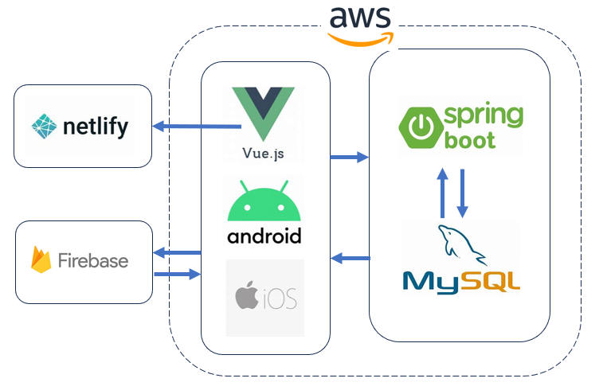

  
   
  

# 🪦 태림원[Taerimwon]

- 서비스명(발주처) : 태림원[Taerimwon]
- 개발기간 : 2023.08.10 ~ 2023.12.04 (진행 중)
- 팀원 : 박한훈, OOO

  

# 🌈 서비스 소개

## 1. 태림원[Taerimwon]이란?

- **유골함/위패 각인 주문 서비스**로, 고객정보를 기반으로 유골함과 위패의 각인 예시를 제공하고 고객을 관리하는 서비스 입니다.

## 2. 서비스 제작 배경

- 포토샵, 일러스트를 통해 제공하는 기존 방식을 개선하고, 고객이 직접 정보를 입력해 주문을 할 수 있는 서비스 제작을 요청받아 제작하게 되었습니다.

  

# 👶 주요 기능

## 🎅 Web

> + ### 주문 관리, 블랙리스트 관리
 

## 1. 주문 내역 관리
   - 발주자 정보, 상주 정보, 발주 장소, 유골함 주문, 위패 주문 내역 관리 

 

## 2. 블랙리스트 관리
   - 블랙리스트에 전화번호를 등록하면 해당 번호는 서비스 이용 불가

  

## ⭐ Android / iOS
> + ### 전화번호 인증 및 블랙리스트 차단, 캡처방지
> + ### 주문 정보 입력 및 각인 정보 출력, 주문 정보 MMS 전송, 유골함 리스트
> + ### 로그 수집

 

## 1. 전화번호 인증
   - 전화번호 인증 후 서비스 이용 가능
   - Firebase

   
   <h3>[즐겨찾기 등록]</h3>

 

   
   
   <h3>[즐겨찾기 삭제]</h3>

  

# 🪦 '태림원'을 이용하면 일어나는 기대효과!

 - 장점
    - 각인을 발주자가 만들 필요없이 자동으로 생성이 가능하다.
 - 단점
    - 앱을 다운로드해야 한다.
    - 지속적인 유지보수(업데이트, 수정)가 필요하다.

  

# 🏃 향후 계획

1. 안드로이드 앱 출시 예정(2023년 12월 예정)
2. iOS 앱 출시 예정(2024년 상반기 예정)

  

# 💻 기술 스택

   

 

> + ### Web : Vue.js, Netlify, Visual Studio Code
> + ### Android : **Android, Kotlin, MVVM 디자인 패턴, Hilt 라이브러리**, Android Studio
> + ### iOS : **iOS, swift**, Xcode
> + ### Back-End : Spring Boot, MVC, AWS, MySQL, Firebase, 가비아 / intellij, Mysql Workbench 
> + ### 형상관리 : **Git**

  

# 👨‍👩‍👧‍👦 역할

<table>
  <tr>
    <td>팀원</td>
    <td>직무</td>
    <td>주요 업무</td>
    <td>한 줄 소감</td>
  </tr>
  <tr>
    <td rowspan="5">박한훈 😆</td>
    <td>Front-End</td>
    <td>- 기능: 주문 관리, 블랙 리스트 관리
     - 기술: Vue.js, Netlify</td>
    <td rowspan="5">발주처의 다양한 요구사항을 해결하는 경험을 할 수 있었고, 용도 및 규모에 따른 기술 선정과 다양한 기술 스택 활용 경험을 할 수 있었습니다.</td>
  </tr>
  <tr>
    <td>Back-End</td>
    <td>- 기능: 주문 관리, 블랙 리스트 관리
     - 기술: Security(jwt), DB설계, Spring Boot, AWS</td>
  </tr>
  <tr>
    <td>Android</td>
    <td>- 기능 : 전화번호 인증 및 블랙리스트 차단, 캡처방지, 주문 정보 입력 및 각인 정보 출력, 주문 정보 MMS 전송, 로그 수집 - 기술 : Android(MVVM/Hilt), Kotlin, nav_graph 설계
     - 2023년 12월 출시 예정</td>
  </tr>
  <tr>
    <td>iOS</td>
    <td>- 기능 : 전화번호 인증 및 블랙리스트 차단, 캡처방지, 주문 정보 입력
     - 기술 : 
     - 2024년 상반기 출시 예정(진행 중)</td>
  </tr>
  <tr>
   <td>기타</td>
      <td>- 디자인 : UI/UX(Figma)
       - 형상관리 : Git
       - 산출물 : 기능명세서, ReadMe 작성, 포팅메뉴얼
      </td>
  </tr>
</table>

# 📚 산출물

# 